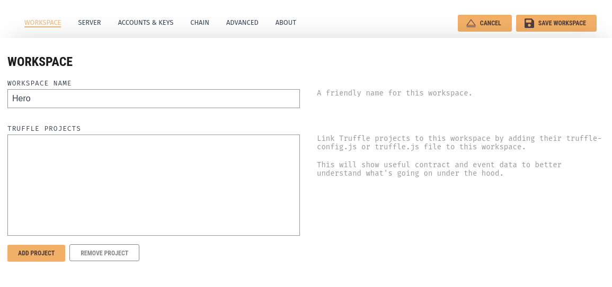
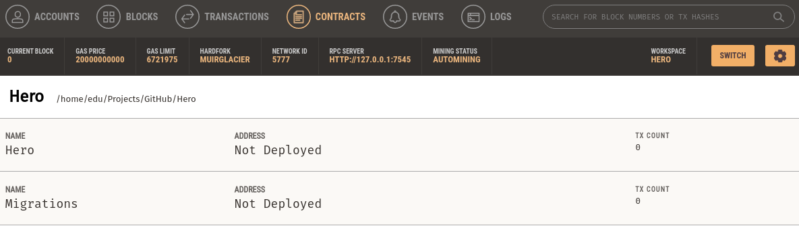

# Deploying Solidity contracts with Truffle - Quickstart

Based on [this Ethereum local development guide by QuickNode](https://www.quicknode.com/guides/web3-sdks/how-to-setup-local-development-environment-for-solidity).

## Dependencies

Install [Truffle](https://trufflesuite.com/truffle).

```bash
npm install
```

### Local

Install [Ganache](https://trufflesuite.com/ganache/). It will prepare a local Ethereum network with a single node and a set number of accounts. Those accounts already have Ether ready to use in contract deployment or usage.

For Linux based systems, Ganache offers its own AppImage that can be integrated with [AppImage Launcher](https://github.com/TheAssassin/AppImageLauncher).

```bash
wget https://github.com/trufflesuite/ganache-ui/releases/download/v2.5.4/ganache-2.5.4-linux-x86_64.AppImage -O ganache.AppImage
chmod +x ganache.AppImage
./ganache.AppImage
```

This will install Ganache GUI. Ganache also offers a CLI and a npm package to interact with it. To start the Ethereum cluster for local development, click on the `Quickstart` button. It should open a view like the following one.


To view contracts deployments, add [truffle-config.js](truffle-config.js) by clicking the `Add Project` button and selecting the file.

Save the Workspace will create the accounts. The `Contracts` page will detect the project contracts, but will correctly indicate that they are not deployed.



### Ropsten

There are two components needed to deploy in Ropsten. A Wallet with enough Ether to cover the gas fees for contract deployment and a node. These two components are managed by sensitive parameters that are placed in a `dotenv` file. Copy the [.example.env](.example.env) file to a newly created file named `.env`. 

Any Wallet that can connect to the Ropsten testnet should suffice, such as Metamask. Ropsten Ether can be obtaining through mining or more commonly, through a faucet. After making sure that the Wallet has a decent amount of Ether, set the `MNEMONIC` parameter in `.env` with its mnemonic phrase. 

The node can be hosted locally or remotely. There are development frameworks like [QuickNode](quicknode.com), [infura.io](infura.io) or [Chainstack](console.chainstack.com) that offer remote Ethereum nodes for development. Once a node is ready to accept RPC calls, set the `.env` parameter `NODE_URL` with the node URL.

## Deploying

Truffle will compile and deploy the contract with the `migrate` option. By default it will deploy the contract on the `development` network, but Ropsten can be selected by specifying it with the `--network` flag.

Local deployment to Ganache.
```bash
truffle migrate
```

Deployment to Ropsten.
```bash
truffle migrate --network Ropsten
```

Deploying in Ropsten can take a while depending on the network conditions.

## Testing
Unit tests can be executed with `truffle test`. As with the deployment, the tests can be done in either `development` or `ropsten` by using the `--network` flag.

## Console interaction
Truffle allows for interaction with the deployed contracts through its console. As with the previous commands, by default it will use the `development` network.

```bash
truffle console
```

Once the shell is changed to `truffle(<network_name>)>`, the network can now be interacted with.

```bash
# Get the instance of the Hero contract
let instance = await Hero.deployed()
instance.getHero()
# Output: 'Hulk'
```
